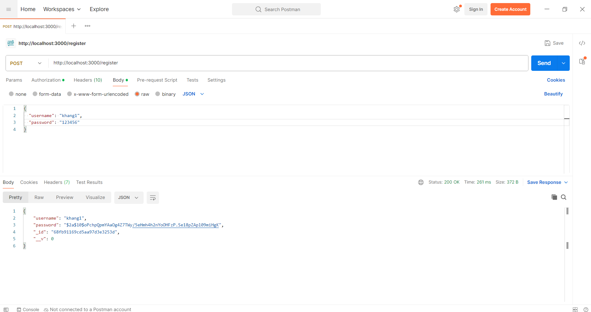
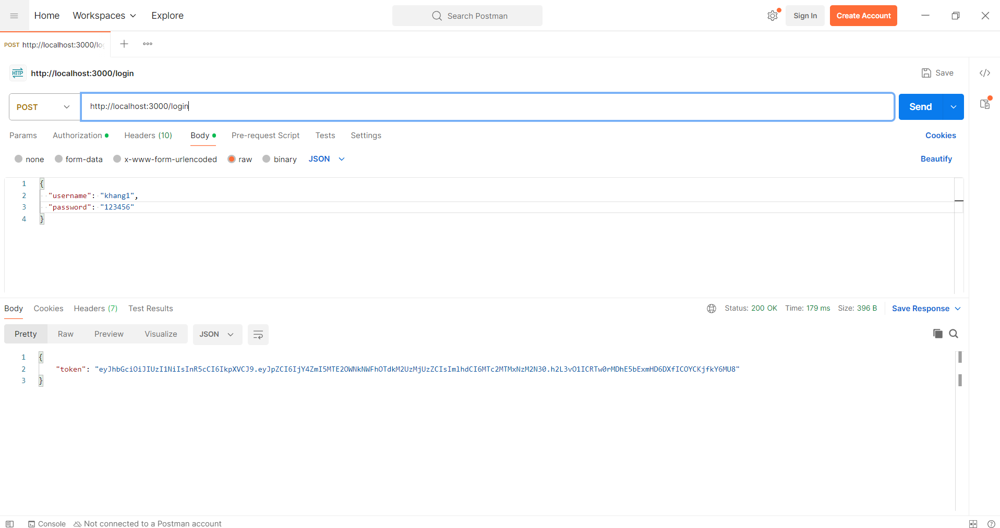
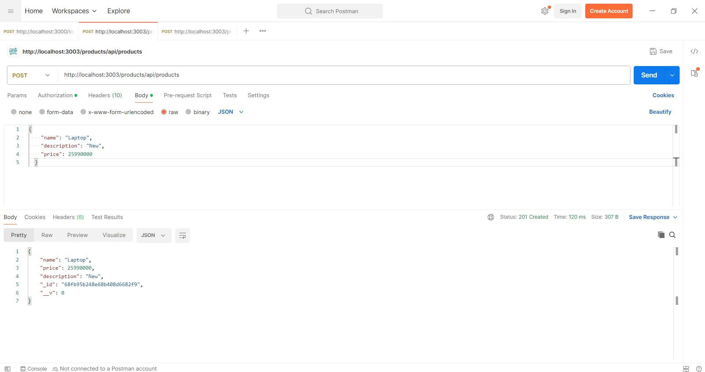

# E-Project: Hệ thống Microservices Bán hàng

Đây là một dự án backend mô phỏng một hệ thống thương mại điện tử đơn giản, được xây dựng theo kiến trúc microservices.

## Kiến trúc hệ thống

Hệ thống bao gồm các thành phần chính sau:

- **API Gateway**: Cổng chính tiếp nhận tất cả request từ client và điều hướng đến các service phù hợp.
- **Auth Service**: Xử lý tất cả các vấn đề liên quan đến xác thực người dùng (đăng ký, đăng nhập, JWT).
- **Product Service**: Quản lý thông tin về sản phẩm.
- **Order Service**: Xử lý logic đặt hàng và tương tác với các service khác qua message queue.
- **MongoDB**: Cơ sở dữ liệu NoSQL để lưu trữ dữ liệu cho các service.
- **RabbitMQ**: Message Broker để giao tiếp bất đồng bộ giữa các service (ví dụ: khi một đơn hàng được tạo).

---

## Yêu cầu cài đặt

Để chạy dự án này, bạn cần cài đặt các phần mềm sau trên máy tính của mình:

- [Docker](https://www.docker.com/products/docker-desktop/) và Docker Compose
- [Postman](https://www.postman.com/downloads/) (để test API)
- [Git](https://git-scm.com/downloads/)

---

## Cài đặt và Chạy dự án với Docker

Đây là cách đơn giản và được khuyến khích để chạy toàn bộ hệ thống chỉ với một vài lệnh.

### Bước 1: Tạo các file cấu hình Docker

Bạn cần tạo các file sau trong dự án của mình.

#### a. Tạo `Dockerfile` cho mỗi service

Tạo một file tên là `Dockerfile` trong **mỗi thư mục service** (`auth`, `product`, `order`, `api-gateway`) với nội dung giống hệt nhau:

```dockerfile
# Sử dụng một image Node.js chính thức làm nền
FROM node:18-alpine

# Tạo thư mục làm việc bên trong container
WORKDIR /app

# Sao chép package.json và package-lock.json
COPY package*.json ./

# Cài đặt các dependencies
RUN npm install

# Sao chép toàn bộ mã nguồn của service vào
COPY . .

# Mở cổng mà ứng dụng sẽ chạy
EXPOSE 3000

# Lệnh để khởi chạy ứng dụng
CMD ["npm", "start"]
```

#### b. Tạo file `docker-compose.yml`

### Bước 2: Khởi chạy hệ thống

Mở terminal ở thư mục gốc của dự án và chạy lệnh:

```bash
docker-compose up --build
```

Lệnh này sẽ build image cho từng service và khởi chạy toàn bộ hệ thống. Bạn sẽ thấy log của tất cả các service hiển thị trên màn hình.

Để dừng hệ thống, nhấn `Ctrl + C`.

---

## Kiểm tra (Testing) với Postman

Sau khi hệ thống đã chạy, bạn có thể dùng Postman để kiểm tra các API. Mọi request đều được gửi đến API Gateway tại `http://localhost:3000`.

### 1. Đăng ký tài khoản

- **Method**: `POST`
- **URL**: `http://localhost:3000/register`
- **Body** (`raw`, `JSON`):
  `json
{
    "username": "khang1",
    "password": "123456"
}
Example:
`
  

### 2. Đăng nhập

- **Method**: `POST`
- **URL**: `http://localhost:3000/login`
- **Body** (`raw`, `JSON`):

  ```json
  {
      "username": "khang1",
      "password": "123456"
  }
  Example:
  ```

  

- **Kết quả**: Copy lại giá trị `token` từ response để sử dụng cho các request tiếp theo.

### 3. Tạo sản phẩm mới

- **Method**: `POST`
- **URL**: `http://localhost:3003/products/api/products`
- **Authorization**: Chọn `Bearer Token` và dán `token` đã copy ở bước 2.
- **Body** (`raw`, `JSON`):
  ```json
  {
    "name": "Laptop",
    "description": "New",
    "price": 25990000
  }
  ```
  
- **Kết quả**: Copy lại giá trị `_id` của sản phẩm vừa tạo.

### 4. Tạo đơn hàng mới

- **Method**: `POST`
- **URL**: `http://localhost:3003/products/api/products/buy` (Lưu ý: đường dẫn này có thể khác tùy theo code của bạn)
- **Authorization**: Tiếp tục dùng `Bearer Token`.
- **Body** (`raw`, `JSON`):
  ```json
  {
    "ids": ["DÁN _id VÀO"]
  }
  ```
  

---
